# Selenium实现Buff商品监控

**项目名称：**Selenium_Buff

**日期：**2023/4/21

**作者：**31Hz

**作者邮箱：**2787723665@qq.com

## 前言

本人近期学习了selenium模块的使用，想通过写一个小项目，其实就是个小脚本（bush ，巩固所学知识，正好最近入坑了CSGO，所以打算写一个监控Buff网站商品价格的程序，方便在低价的时候入手喜欢的枪械

代码基本做到了一行一注释，想学习selenium的小伙伴可以参考

由于是第一次写这类程序，python也是刚学不久，代码写的不好，还请谅解！！！

## 使用教程

### 基本环境

- Python：3.9
- Chrome浏览器：https://www.google.cn/chrome/index.html
- Chromedriver：https://chromedriver.chromium.org/downloads
- 开发工具：pycharm，miniconda
- 库：selenium

### 快速上手

#### 替换Chromedriver

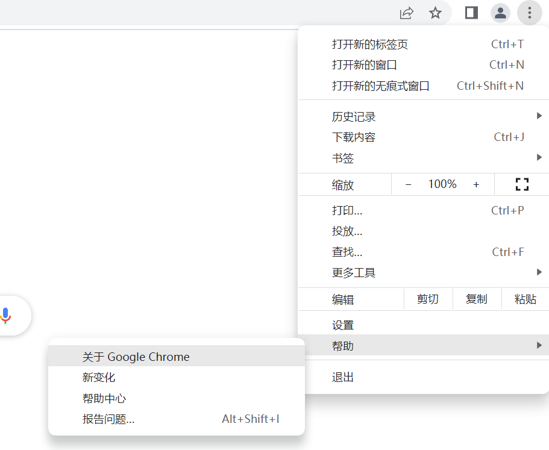

点击关于Google Chrome查看Chrome的版本

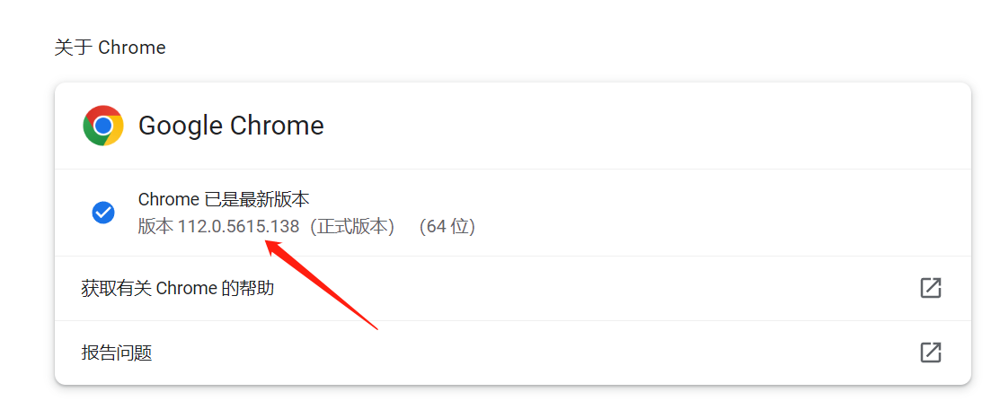

找到对应的Chromedriver版本下载

（注意：大版本相同即可，我这里找112.0.5615.xxx的都可以使用）

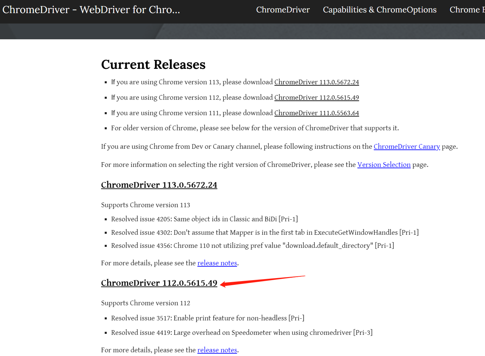

替换掉项目下driver文件夹中的chromedriver

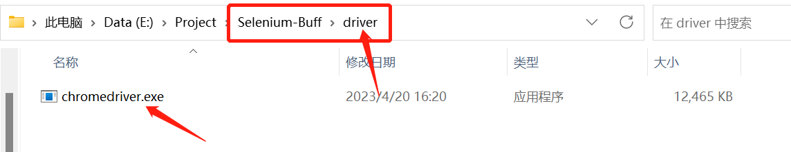

#### 创建虚拟环境

创建python环境

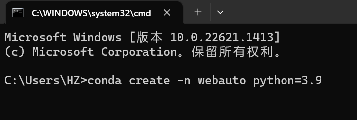

进入虚拟环境下载selenium包

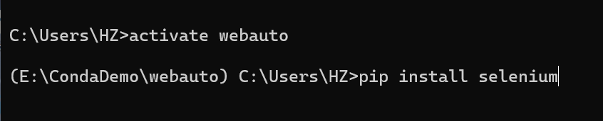

#### pycharm应用虚拟环境打开项目

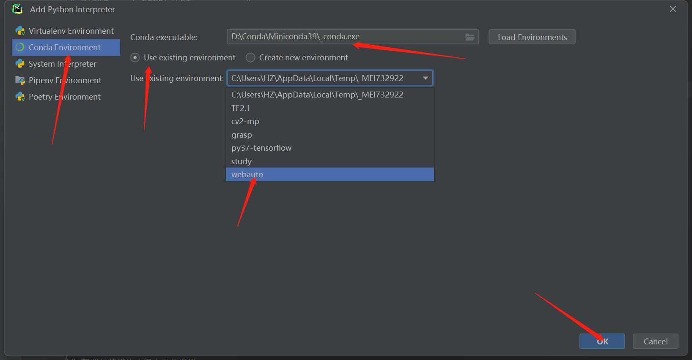

#### 开启qq邮箱服务

参考文章：https://zhuanlan.zhihu.com/p/360322610

#### 参数修改

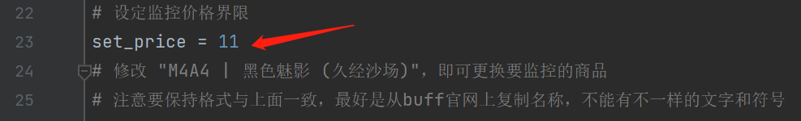

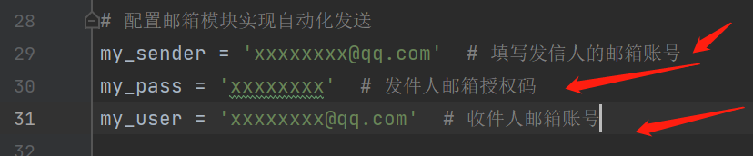

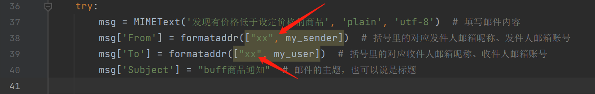

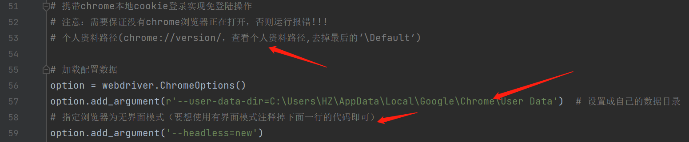

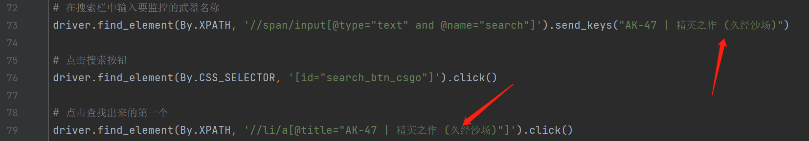

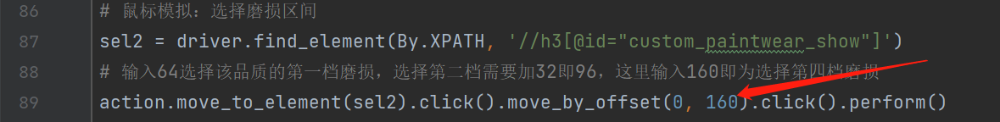

#### 效果展示

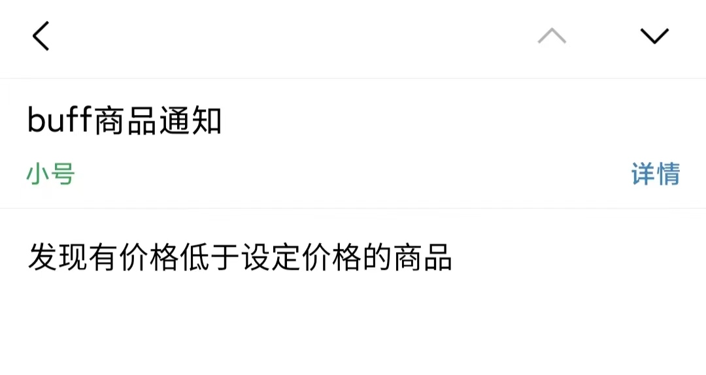

